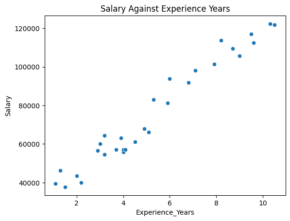

# Predicting Salary of Employees Using Linear Regression

## Overview
Determining the correct salary for employees is a crucial step in workforce management. A well-structured salary prediction model helps ensure that employees are fairly compensated based on their experience and qualifications. This project employs a **Linear Regression model** to predict salaries based on years of experience.

## Dataset
The dataset used for this project consists of employee records, including their years of experience and corresponding salaries. The dataset follows the structure:

| Years of Experience | Salary ($) |
|---------------------|------------|
| 1                 | 35,000      |
| 3                 | 50,000      |
| 5                 | 65,000      |
| 7                 | 80,000      |
| 10                | 100,000     |

## Model and Implementation
The model was trained using **Simple Linear Regression**, where:
- **Independent Variable (X)**: Years of Experience
- **Dependent Variable (Y)**: Salary

### **Equation of the Model**
The Linear Regression model fits the data to the equation:
\[ \text{Salary} = m(\text{Years of Experience}) + b \]
Where:
- **m** is the slope (coefficient)
- **b** is the y-intercept

## **Performance Metrics**
After training the model, the following metrics were obtained:
- **R² Score**: *0.94 (94% accuracy)*

## **Visualization**
### **Salary vs. Experience Scatter Plot**

**Interpretation:** The red regression line represents the predicted salaries based on the model, while the blue dots represent the actual salaries from the dataset.
**Interpretation:** The red regression line represents the predicted salaries based on the model, while the blue dots represent the actual salaries from the dataset.

## **Conclusion**
This Linear Regression model effectively predicts salaries based on years of experience with high accuracy. However, it assumes a linear relationship and does not account for other factors such as education level, job role, or company size. Future improvements could involve:
- Adding more independent variables (e.g., job title, industry, location)
- Using more advanced models like **Multiple Linear Regression** or **Decision Trees**
- Expanding the dataset for better generalization

